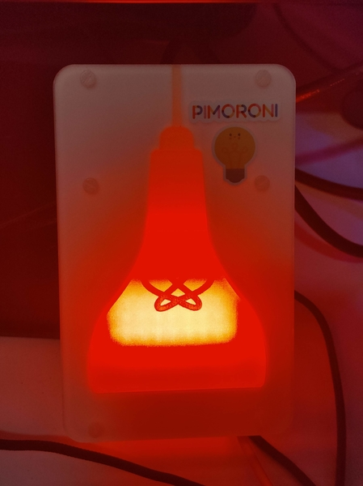
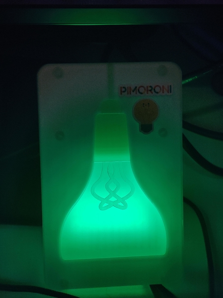

# Live Light

A Mood light that will change colour depending from red -> green (vice versa), if the user is busy. It was intended
to be used to show others that I am in a meeting. It is built specifically for a Raspberry PI connected to a 
[Pirmoroni Mood Light](https://learn.pimoroni.com/tutorial/sandyj/assembling-mood-light).

<span>
  
  
</span>

This repo consists of two packages:

> Info: you can find the debian packages to install [here in releases](https://gitlab.com/hmajid2301/live-light/-/releases)

## Live Light Server

This Debian package is to be installed on the device with the Mood light (i.e. The PI).
It runs a simple Gunicorn, Flask API. Hosted by Nginx. It allows you use a REST API to
change the colour on the Mood light. 

An example request make look like (assuming your PI is called `raspberrypi.local`):

```bash
curl -X PUT --header "Content-Type: application/json"\
            --data '{"red":0,"green":255, "blue": 0}' \
            http://raspberrypi.local/color
```

## Live Light Client

This debian package is to be installed on the host machine where the USB will be plugged into.
In my case it's my Desktop where it detects if my headset is plugged in and changes the colour
accordingly. When you install the package it will ask a few questions.

### USB Name

You can get this on by running `lsusb`. Then copy the device name `Corsair Corsair VOID RGB USB Gaming Headset`.

```bash
$ lsusb
Bus 006 Device 001: ID 1d6b:0003 Linux Foundation 3.0 root hub
Bus 005 Device 003: ID 1b1c:1b5c Corsair CORSAIR NIGHTSWORD RGB Gaming Mouse
Bus 005 Device 002: ID 1b1c:1b49 Corsair CORSAIR K70 RGB MK.2 Mechanical Gaming Keyboard
Bus 005 Device 001: ID 1d6b:0002 Linux Foundation 2.0 root hub
Bus 004 Device 001: ID 1d6b:0003 Linux Foundation 3.0 root hub
Bus 003 Device 004: ID 1b1c:0c12 Corsair Corsair VOID RGB USB Gaming Headset 
Bus 003 Device 003: ID 05e3:0608 Genesys Logic, Inc. Hub
...
```

### PI Address

The address (including schema) of your `live-light-server`. Such as `http://raspberrypi.local`.
This is the URL the client will make the requests to.

## Demo

[](http://www.youtube.com/watch?v=7YuyvgypuXI "Live Light Demo")

## Reasoning

This is a just simple tool I built over a weekend during the coronavirus lockdown, so that others in my household
would know when I was in a meeting. The reason I ended up changing the light by using a USB was because I have a lot
of impromptu meetings that aren't in my calendar. I did think about using my calendar originally. Also I end up using
a few meeting apps such as Skype, Slack & Teams. So it also wouldn't so simple to detect if I was in a call in either
of them.

## Future Features

- Make requests using HTTPS.
- Set Active/inactive colour via config
- Allow other methods of changing colour (generalise)
- Extend `live-light-server` api to be able to display more complicated patterns
- Add docker images

## Appendix

- [Assemble Mood Light](https://www.youtube.com/watch?v=eHD9JIQk0I)
- [Setup `.local` address](https://www.howtogeek.com/167190/how-and-why-to-assign-the-.local-domain-to-your-raspberry-pi/)
- [Inspired By](https://dev.to/azure/an-iot-busy-light-for-folks-working-from-home-34ig)

> P.S I'm sorry to my other brits for misspelling colour so may times 😢.